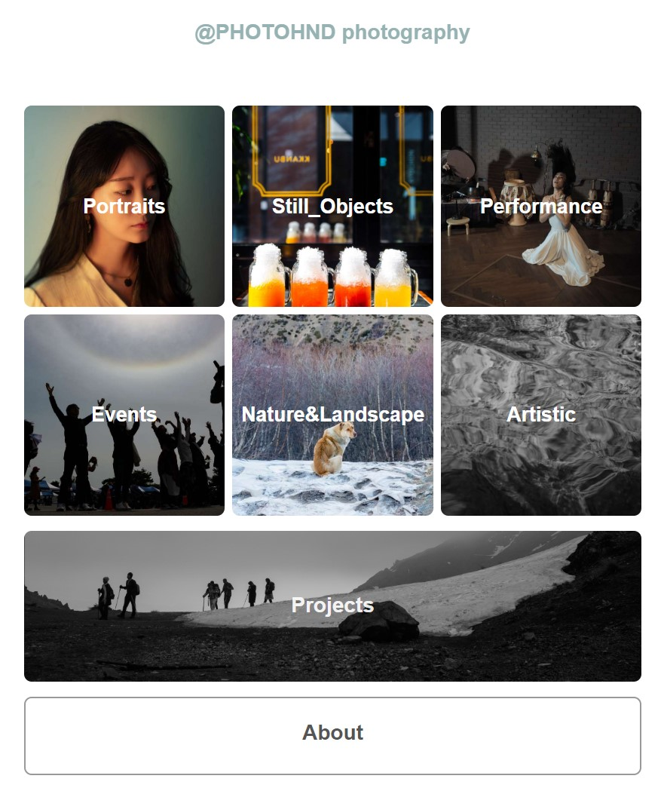

# portfolio_PHOTOHND

<a href="http://photohnd.synology.me/index.php">PHOTOHND PHOTOGRAPHY</a>

developing a personal photographic portfolio webpage

프론트 스타일은 6개 카테고리를 먼저 제시하고 카테고리를 선택하면 추가 사진을 보여주는 방식

<기본 구조>
header : 사이트 이름
nav : 사진 카테고리 표시, 클릭하여 세부 카테고리 or 갤러리 표시
section : 프로젝트, 소개 표시
  - projects : 출판, 전시, 기타 프로젝트 소개
  - about : 사진가 소개
footer : 저작권 표시

디폴트 : 대표 이미지 위에 카테고리 이름 표시
각 카테고리 마우스 호버링 효과
각 카테고리 마우스 클릭/터치 : 카테고리별 갤러리 표시

